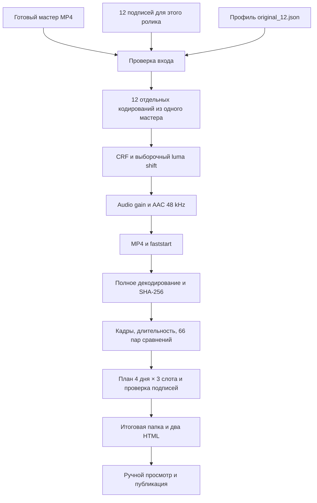

<div align="center">

# Instagram Reels Uniquilization

**Один готовый Reel → 12 вариантов → проверка потоков → план публикаций**

Python · FFmpeg · H.264 / libx264 · AAC · SHA-256 · локальный HTML

Пайплайн [teskor-hub](https://github.com/teskor-hub), выделенный из рабочей пачки **010**.

</div>

---

Скрипт берёт законченный MP4 и создаёт 12 технически различающихся версий с сохранением монтажа, размера кадра и темпа. В основе — **разные CRF, небольшой сдвиг luma у части вариантов, индивидуальный audio gain и повторное кодирование**. Затем он проверяет реальные файлы и собирает план с 12 отдельными подписями.

Здесь опубликован именно метод из Instagram-пачки `010`: настройки перенесены без изменения. При проверке на исходном ролике все 12 новых MP4 **побайтно совпали с первоначальными файлами**. Повторный полный прогон дал тот же результат.

> **Что здесь означает «уникализация».** Различаются SHA-256 файлов, сжатых видео- и аудиопотоков, а также декодированного звука. Это измеримый результат. Он не доказывает, что Instagram посчитает ролики разным контентом, и не прогнозирует охваты. Смысловое содержание видео остаётся прежним.

## Навигация

- [Быстрый старт](#быстрый-старт)
- [Полный пайплайн](#полный-пайплайн)
- [Точные настройки 12 вариантов](#точные-настройки-12-вариантов)
- [Почему меняются файлы и потоки](#почему-меняются-файлы-и-потоки)
- [Правило подписей](#правило-подписей)
- [Что проверяется](#что-проверяется)
- [Повторная проверка и обновление подписей](#повторная-проверка-и-обновление-подписей)
- [Ограничения и разбор ошибок](#ограничения-и-разбор-ошибок)
- [Структура репозитория](#структура-репозитория)

## Быстрый старт

### 1. Подготовить окружение

Нужны **Python 3.10+**, Git и сборка [FFmpeg](https://ffmpeg.org/download.html) с `ffmpeg`, `ffprobe`, `libx264` и `aac` в `PATH`. Обработка выполняется на CPU. Внешних Python-зависимостей, API-ключей и модели генерации для этого этапа нет.

Проверенная среда: Windows, Python 3.14, FFmpeg 8.0.1. На Linux/macOS используются те же Python-скрипты, но полный прогон в этой публикации проверен только на Windows.

Команды ниже — **PowerShell**, по одной строке:

```powershell
git clone https://github.com/teskor-hub/instagram-reels-uniquilization.git
cd instagram-reels-uniquilization
python --version
ffmpeg -version
ffprobe -version
ffmpeg -hide_banner -h encoder=libx264
ffmpeg -hide_banner -h encoder=aac
```

### 2. Подготовить мастер и подписи

Создайте папку `input`, положите в неё готовый ролик как `reel.mp4` и подготовьте `captions.json` с **12 подписями именно для него**.

```powershell
New-Item -ItemType Directory -Force input
Copy-Item examples\captions_010.json input\captions.json
notepad input\captions.json
```

**Перед запуском перепишите примеры.** Файл `examples/captions_010.json` показывает формат и содержит подписи конкретной старой пачки. Это не универсальный набор для копирования в следующие публикации.

Формат: объект JSON с полем `captions`, содержащим массив из 12 непустых строк; необязательное поле `description`. Переносы строк внутри подписи записываются как `\n`. Сохраните JSON в UTF-8.

Мастер должен быть уже смонтирован: надписи внутри кадра, переходы и музыка включены в MP4. Для исходного `010` именно так и было — дополнительный слой текста при уникализации не создавался. Проверенный мастер: **768×1376, 24 fps, 145 кадров, 6,042 с, stereo**.

### 3. Запустить всю цепочку

```powershell
python uniquify.py "input\reel.mp4" "output\reel_010" --prefix 010 --captions "input\captions.json"
```

Скрипт последовательно создаст варианты, полностью декодирует их для проверки, сравнит хеши и кадры, соберёт подписи и дважды проверит согласованность JSON с HTML.

После `PASS`:

```powershell
Start-Process "output\reel_010\verification.html"
Start-Process "output\reel_010\upload_plan.html"
```

HTML работает локально, без сервера и внешних CDN, со светлой и тёмной темой. В плане укажите время первой публикации **T0 по Москве** и нажмите «Рассчитать даты».

### Что появится в результате

```text
output/reel_010/
├── 010_u01.mp4
├── ...
├── 010_u12.mp4
├── manifest.json             # профиль, версии инструментов, хеш источника
├── unique_verification.json  # хеши, параметры, сравнение всех 66 пар
├── verification.html         # читаемый технический отчёт
├── posting_plan.json         # файл → подпись → день → слот
└── upload_plan.html          # локальный календарь публикаций
```

Папка результата должна быть новой. Существующие пачки не перезаписываются. До успешной проверки сборка живёт в соседней папке `.имя.partial-...`; при ошибке она сохраняется для диагностики, а итоговое имя ей не присваивается.

## Полный пайплайн



| Этап | Что происходит | Зачем |
|---|---|---|
| Подготовка | Монтаж, переходы, музыка и экранные надписи уже в мастере | Каждая версия строится из одного законченного видео |
| Проверка входа | Проверяются инструменты, профиль, подписи, видео/аудио, чётные размеры и 8-bit SDR `yuv420p` | Ошибки входа обнаруживаются до рендера |
| Варианты | Каждый MP4 кодируется прямо из мастера | Нет цепочки повторного сжатия `u01 → u02 → u03` |
| Видео | `libx264`, индивидуальный CRF, luma-фильтр у 7 вариантов | Меняются сжатый поток и часть декодированных пикселей |
| Звук | Уменьшение уровня и AAC 192 kbit/s, 48 kHz | Меняются аудиопакеты и декодированные PCM-данные |
| Контейнер | Отключение переноса метаданных/глав, очистка полей, `+faststart` | Контролируемая упаковка результата |
| Контроль | 12 файлов, четыре семейства хешей, видео/аудиопараметры, метрики | Измеряется фактический результат обработки |
| Подписи | 12 текстов, поиск дублей и близких формулировок | Одна и та же подпись не размножается на всю пачку |
| План | Четыре дня, три слота в день | Файлы, тексты и относительное время собраны в одном месте |

В репозитории реализован участок **от готового мастера до локальной пачки публикаций**. Создание исходного видео и его ручная загрузка в Instagram остаются внешними этапами. Скрипты не подключаются к Instagram и не управляют аккаунтами.

## Точные настройки 12 вариантов

Источник настроек — [`profiles/original_12.json`](profiles/original_12.json). Порядок совпадает с исходной пачкой `010`.

| Вариант | CRF | Luma shift | Audio gain |
|---|---:|:---:|---:|
| u01 | 27.5 | — | −0.03 dB |
| u02 | 27.4 | — | −0.06 dB |
| u03 | 20.0 | да | −0.09 dB |
| u04 | 19.9 | да | −0.12 dB |
| u05 | 19.8 | да | −0.15 dB |
| u06 | 27.3 | — | −0.18 dB |
| u07 | 27.2 | — | −0.21 dB |
| u08 | 27.1 | — | −0.24 dB |
| u09 | 19.7 | да | −0.27 dB |
| u10 | 19.6 | да | −0.30 dB |
| u11 | 19.5 | да | −0.33 dB |
| u12 | 19.4 | да | −0.36 dB |

Общие параметры кодирования:

```text
video:      libx264 / preset medium / High / level 4.1 / yuv420p
GOP:        keyint=240:min-keyint=24:scenecut=40
audio:      aac / 192k / 48000 Hz / исходное число каналов
metadata:   map_metadata=-1 / map_chapters=-1
clear:      title, comment, description, video/audio handler_name
flags:      bitexact для кодеков; исходный fflags +bitexact
container:  MP4 / +faststart
```

Разрешение, FPS и количество кадров проверяются относительно мастера. Изменения скорости, зеркалирования, кропа и наложения шума в этом профиле нет. `keyint=240` задаёт верхний интервал GOP; это не означает, что шестисекундное видео будет иметь длину 240 кадров.

## Почему меняются файлы и потоки

### CRF: новое сжатие видеоданных

CRF задаёт режим качества `libx264`. Другая настройка может изменить квантование и сжатые данные. В исходном методе соседние значения отличаются на 0.1, а варианты разделены на группы около 27 и 20. Конкретно на ролике `010` этого вместе с luma-фильтром достаточно для 12 разных видеопотоков.

Меньшее значение CRF обычно означает более высокое качество и больший файл. Это не процент качества и не заранее заданный битрейт. Для другого видео близкие значения могут дать совпадения — поэтому различие проверяется после кодирования. Параметры интерфейса описаны в [документации FFmpeg/libx264](https://ffmpeg.org/ffmpeg-codecs.html#libx264_002c-libx264rgb).

### Luma: небольшое изменение компоненты яркости

Точное выражение исходного метода:

```text
lut=y='if(eq(mod(val,28),0),val,val+1)'
```

Для 8-bit YUV значений, кратных 28, яркость сохраняется; для остальных запрашивается прибавка одной единицы с ограничением диапазоном формата. Например, `0 → 0`, `28 → 28`, `100 → 101`. Чистый ноль фильтр оставляет нулём, но это не обещание побайтного сохранения чёрных кадров после lossy-кодирования.

Это **фиксированный дискретный сдвиг**, а не случайный шум. Число 28 перенесено из рабочего скрипта; доказательства его особой эффективности против Instagram здесь нет. Назначение Y-компоненты и переменной `val` описано в [документации LUT-фильтров](https://ffmpeg.org/ffmpeg-filters.html#lut_002c-lutrgb_002c-lutyuv).

### Audio gain: различается и декодированный звук

Вариант `n` получает `−0.03 × n dB`. Линейная амплитуда умножается на `10^(gain/20)`: диапазон этой пачки примерно **0.9966…0.9594** от исходного уровня. Звук немного тише, без намеренного изменения темпа или высоты тона, после чего кодируется в AAC с целевой скоростью 192 kbit/s.

Новая AAC-дорожка сама по себе ещё не доказывает различие звуковых отсчётов. Поэтому отдельная проверка декодирует каждую версию в PCM signed 16-bit / 48 kHz и сравнивает его SHA-256. Реализация уровня опирается на [фильтр `volume`](https://ffmpeg.org/ffmpeg-filters.html#volume).

На тишине gain не создаёт содержательного различия: ноль остаётся нулём. Такой вход может не пройти требование 12 разных декодированных дорожек.

### Метаданные и MP4: упаковка отдельно от содержания

`-map_metadata -1` отключает автоматический перенос глобальных метаданных, `-map_chapters -1` — глав; перечисленные поля явно очищаются. Служебная структура MP4, brands и технические данные кодеков всё равно существуют. Выражение «файл без каких-либо метаданных» для этого результата неверно. Семантика mapping описана в [документации FFmpeg](https://ffmpeg.org/ffmpeg-doc.html#Advanced-options).

`+faststart` переносит индекс MP4 к началу файла для начала воспроизведения до полной загрузки. Это свойство контейнера, а не отдельный метод изменения картинки. См. [MOV/MP4 muxer](https://ffmpeg.org/ffmpeg-formats.html#mov_002c-mp4_002c-ismv).

`bitexact` не является генератором случайности. Повторная обработка теми же версиями инструментов и настройками на проверенном ПК дала одинаковые файлы. Повторный запуск **не создаёт ещё 12 новых уникализаций** относительно прошлой пачки.

## Правило подписей

**Один общий каркас допустим. Одинаковые подписи — нет.**

Например, можно использовать структуру:

```text
HOOK: самостоятельная мысль, наблюдение или вопрос
BODY: конкретная деталь этого ролика и отдельный смысловой акцент
CTA: при необходимости — подходящий вопрос, а не одинаковый призыв везде
HASHTAGS: релевантный набор для этой формулировки
```

Каждая из 12 подписей должна быть отдельным текстом по сути: другой акцент, наблюдение, эмоция, интерпретация или вопрос. Копирование 1 в 1, замена номера/эмодзи, перестановка hashtags или несколько синонимов в одинаковом предложении не подходят. Новый ролик получает новый набор, а не автоматическую подстановку старого файла.

Одна сцена может получить разные ракурсы текста: подготовка утром, смена настроения, забавное противоречие, заметная деталь, вопрос зрителю. Все утверждения должны соответствовать тому, что действительно есть в ролике.

### Задание для подготовки 12 текстов

Скопируйте этот **шаблон задания**, заполните описание и факты. Повторяется структура задания, а не готовые captions:

```text
Ролик: [что происходит, какие события и детали видны]
Аудитория и язык: [...]
Тон: [...]
Подтверждённые факты: [...]
Ранее использованные подписи, которые нельзя повторять: [...]

Напиши 12 Instagram captions для 12 вариантов этого ролика.
Общий каркас: hook → конкретная мысль/деталь → необязательный CTA → hashtags.
В каждой подписи нужен самостоятельный смысловой акцент и новая формулировка.
Не копируй прежние подписи. Не ограничивайся заменой номера, emoji или пары слов.
Не придумывай события и факты, которых нет в описании.
В каждой подписи минимум 3 релевантных hashtags; полные наборы не повторяются.
Проверь тексты попарно и перепиши близкие варианты.
Верни JSON вида {"captions": [12 строк]}; переносы внутри строки обозначь \n.
```

Скрипт не вызывает языковую модель и не генерирует подписи. Он получает подготовленный JSON.

### Что отсекает автоматическая проверка

| Проверка | Условие |
|---|---|
| Количество | Ровно 12 непустых строк |
| Точный дубль | После Unicode NFKC, `casefold` и нормализации пробелов все строки различаются |
| Hashtags | Не менее 3 в каждой подписи, все 12 полных наборов различаются |
| Близкая формулировка | `SequenceMatcher < 0.86` после удаления hashtags и пунктуации |
| Общие слова | Token Jaccard `< 0.65` для каждой пары |
| План | Текст в JSON и HTML должен совпасть с переданным файлом captions |

Общие hashtags между подписями допустимы; проверяется повтор всего набора. Эти пороги взяты из исходного пайплайна и являются эвристиками. **Они не распознают смысл и не гарантируют уникальность текста.** Необычные перефразирования могут пройти, а нормальные короткие подписи — оказаться слишком похожими. Редактор перечитывает все 12 текстов и сравнивает их с прошлой публикацией. Проверка между разными пачками автоматически не выполняется.

## Что проверяется

Проверка открывает каждый итоговый MP4 заново. Она не доверяет только настройкам команды или тому, что FFmpeg завершился успешно.

| Уровень | Проверка | Что подтверждает |
|---|---|---|
| Декодирование | Полный video + audio decode с `-xerror` | Нет ошибок декодирования, обнаруженных этим прогоном |
| Контейнер | SHA-256 всего MP4 | Различие файлов побайтно |
| Видео | SHA-256 пакетов `-map 0:v:0 -c copy` | Различие сжатого видеопотока |
| Аудио | SHA-256 пакетов `-map 0:a:0 -c copy` | Различие сжатого аудиопотока |
| PCM | SHA-256 звука после decode в s16 / 48 kHz | Различие декодированных звуковых отсчётов |
| Геометрия/время | Размеры, средний FPS и число декодированных кадров равны мастеру | Сохранены эти параметры видео |
| Длительность | `abs(output − source) < 0.05 с` | Допустимая погрешность контейнерной длительности |
| Формат | H.264 High / yuv420p, AAC 48 kHz, число каналов как у мастера | Выход соответствует выбранному формату |
| Картинка | MAE и Pearson correlation к источнику и для всех 66 пар | Измеренное сходство уменьшенных выборок |

В SHA-256 потоков через `hash` не входят контейнерные timestamps; это не аналог визуального или акустического fingerprint Instagram. См. [FFmpeg hash muxer](https://ffmpeg.org/ffmpeg-formats.html#hash-1).

Визуальная выборка — `fps=4,scale=64:64,format=gray`. Нормализованный MAE считается как `mean(abs(A−B))/255`. **MAE 0.45% не означает «качество 99.55%».** Эта выборка не оценивает полноразмерные лица, мелкий текст, цвет, каждый кадр перехода или слышимость изменений. На равномерной выборке Pearson correlation не определена и записывается как `null`.

`PASS` требует 12 разных значений каждого семейства хешей и успешных технических проверок. Для MAE/корреляции нет выдуманного «порога Instagram»: значения показываются для ручного просмотра, а не используются как доказательство распознавания платформой.

### Проверено на исходном 010

| Показатель | Результат |
|---|---:|
| Исходник | 768×1376 / 24 fps / 145 кадров / 6.042 с |
| Выходные файлы | 12 |
| Длительность каждого выхода | 6.048 с |
| Разные контейнеры / видео / AAC / PCM | 12 / 12 / 12 / 12 |
| Максимальный MAE между вариантами | 0.449813% |
| Минимальная корреляция между вариантами | 0.99993913 |
| Побайтное совпадение с первоначальной пачкой | 12 из 12 |
| Совпадение двух последовательных полных прогонов | 12 из 12 |

Измерения сделаны **12 сентября 2026**. Это результат конкретного мастера и окружения, а не обещание для любого входа. Локальный [отчёт проверки](docs/validation.html) описывает метод проверки и её границы. Сам мастер и готовые личные видео в Git не входят.

## Повторная проверка и обновление подписей

Перепроверить готовые MP4, не перекодируя их:

```powershell
python verify_variants.py "input\reel.mp4" "output\reel_010" --prefix 010
```

После редактирования `input/captions.json` обновить план, сохранив видео:

```powershell
python posting_plan.py "output\reel_010" --prefix 010 --captions "input\captions.json"
python posting_plan.py "output\reel_010" --captions "input\captions.json" --verify
python posting_plan.py "output\reel_010" --captions "input\captions.json" --verify
```

`manifest.json` фиксирует входы **первоначальной сборки**. После отдельного редактирования подписей актуальные тексты находятся в переданном captions JSON и пересобранном плане; исходный `captions_sha256` в manifest автоматически не обновляется.

### Расписание

В исходном процессе: **4 последовательных дня × 3 публикации**. Относительно начала каждого 24-часового периода — `T0`, `T0 + 5 часов`, `T0 + 10 часов`. Следующий период начинается через 24 часа.

Если T0 = 09:00, слоты будут 09:00 / 14:00 / 19:00. Если T0 позднее 14:00, третий слот может перейти на следующую календарную дату; подпись «день» обозначает период относительно T0. HTML всегда показывает фактическую дату.

Это рабочая схема автора для организации файлов, **не рекомендация Instagram и не настройка автопостинга**. Подходящий момент публикации выбирается вручную.

### Другой профиль

```powershell
python uniquify.py "input\reel.mp4" "output\experiment_01" --prefix exp --captions "input\captions.json" --config "profiles\original_12.json"
```

Для эксперимента сделайте отдельную копию JSON и измените `crf`, `audio_gain_db`, `luma_shift`. Нужны ровно 12 элементов с `index` от 1 до 12. Другой профиль уже не является точным воспроизведением исходной пачки. Проверка хешей и ручной просмотр остаются обязательными.

## Ограничения и разбор ошибок

| Ситуация | Причина и действие |
|---|---|
| `ffmpeg` / `ffprobe` не найдены | Добавьте каталог установленного FFmpeg в PATH, откройте новый терминал |
| `Unknown encoder libx264` | Нужна сборка FFmpeg с этим кодеком |
| Нет аудио | Профиль меняет настоящий звук; подготовьте мастер со звуковой дорожкой |
| 12 разных PCM не получилось | Тишина или слишком похожий результат; изучите исходник и отчёт, не объявляйте такую пачку готовой |
| 12 разных видеопотоков не получилось | На другом содержимом близкие CRF могут совпасть; измените отдельный экспериментальный профиль и проверьте заново |
| Подписи похожи | Перепишите мысль и формулировку; замена emoji или tags не решает проблему |
| Ошибка JSON | Проверьте кавычки, запятые, `\n`, UTF-8 и ровно 12 строк |
| Папка уже существует | Укажите новое имя результата |
| Осталась `.partial-...` | Сборка не прошла целиком; смотрите сообщение и файлы диагностики, исходная пачка не перезаписывается |
| HDR, 10-bit, другой pixel format | Сначала подготовьте SDR 8-bit `yuv420p` мастер; автоматического tone mapping здесь нет |
| Изменились FPS/число кадров | Подготовьте корректный мастер с постоянным FPS; этот профиль не предназначен для нормализации VFR |
| 4K, высокий FPS | Исходный профиль заявляет H.264 level 4.1 и проверен на 768×1376@24; это не универсальный пресет для любого разрешения |

Проверяется только первая видеодорожка и первая аудиодорожка мастера; субтитры отдельным потоком, главы и дополнительные дорожки не переносятся. Не используйте этот шаг как замену полноценному мастерингу.

Перед публикацией просмотрите **полные MP4 со звуком**: лица и детали, читаемость надписей, переходы и музыку. Контактные листы и числовые метрики помогают сравнивать, но не заменяют этот просмотр. Платформенную эффективность метода можно оценить только отдельно; данные такого эксперимента в репозитории отсутствуют.

## Структура репозитория

```text
.
├── README.md
├── uniquify.py                 # последовательная сборка и финальная проверка
├── verify_variants.py          # декодирование, хеши, метрики и HTML-отчёт
├── posting_plan.py             # подписи, расписание, HTML и сверка плана
├── profiles/
│   └── original_12.json         # точные параметры исходной пачки
├── examples/
│   └── captions_010.json        # пример формата; переписать под свой Reel
├── docs/
│   └── validation.html         # результаты проверки публикации
└── .gitignore                  # локальные входы, результаты и служебные файлы
```

Это обычные процедурные Python-скрипты: запуск `python script.py`, без пакета, сборки и установки Python-зависимостей. Медиа, каталоги `input/`, `output/`, `tmp/` исключены из Git.

**Автор и сопровождающий: [teskor-hub](https://github.com/teskor-hub).**
