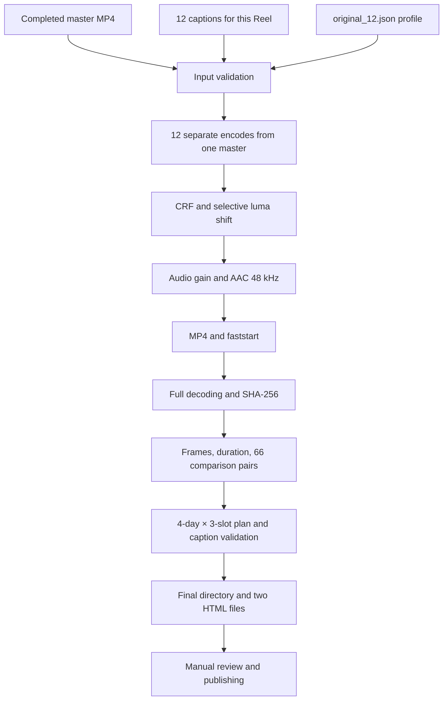

<div align="center">

# Instagram Reels Uniquilization

**One finished Reel → 12 variants → stream verification → posting plan**

Python · FFmpeg · H.264 / libx264 · AAC · SHA-256 · local HTML

A [teskor-hub](https://github.com/teskor-hub) pipeline extracted from the working **010** batch.

</div>

---

The script takes a completed MP4 and creates 12 technically distinct versions while preserving the edit, frame size, and pacing. It uses **different CRF values, a small luma shift for some variants, individual audio gain, and re-encoding**. It then verifies the actual files and builds a plan with 12 distinct captions.

This repository publishes the exact method used for Instagram batch `010`: the settings were transferred unchanged. When verified against the source Reel, all 12 new MP4s **matched the original files byte for byte**. A repeated full run produced the same result.

> **What “uniquilization” means here.** The SHA-256 values of the files, compressed video and audio streams, and decoded audio differ. That is a measurable result. It does not prove that Instagram will consider the Reels different content, and it does not predict reach. The video’s semantic content remains the same.

## Navigation

- [Quick start](#quick-start)
- [Full pipeline](#full-pipeline)
- [Exact settings for the 12 variants](#exact-settings-for-the-12-variants)
- [Why files and streams change](#why-files-and-streams-change)
- [Caption rule](#caption-rule)
- [What is verified](#what-is-verified)
- [Re-verification and caption updates](#re-verification-and-caption-updates)
- [Limitations and troubleshooting](#limitations-and-troubleshooting)
- [Repository structure](#repository-structure)

## Quick start

### 1. Prepare the environment

You need **Python 3.10+**, Git, and an [FFmpeg](https://ffmpeg.org/download.html) build with `ffmpeg`, `ffprobe`, `libx264`, and `aac` in `PATH`. Processing runs on the CPU. This step has no external Python dependencies, API keys, or generation model.

Verified environment: Windows, Python 3.14, FFmpeg 8.0.1. The scripts are intended to run on Linux/macOS as well, but end-to-end operation was verified only on Windows for this release.

The commands below are **PowerShell**, one per line:

```powershell
git clone https://github.com/teskor-hub/instagram-reels-uniquilization.git
cd instagram-reels-uniquilization
python --version
ffmpeg -version
ffprobe -version
ffmpeg -hide_banner -h encoder=libx264
ffmpeg -hide_banner -h encoder=aac
```

### 2. Prepare the master and captions

Create an `input` directory, put the completed Reel there as `reel.mp4`, and prepare `captions.json` with **12 captions specifically for that Reel**.

```powershell
New-Item -ItemType Directory -Force input
Copy-Item examples\captions_010.json input\captions.json
notepad input\captions.json
```

**Rewrite the examples before running the pipeline.** `examples/captions_010.json` demonstrates the format and contains captions from one specific older batch. It is not a universal set to copy into future posts.

Format: a JSON object with a `captions` field containing an array of 12 non-empty strings; the `description` field is optional. Write line breaks inside a caption as `\n`. Save the JSON as UTF-8.

The master must already be edited: on-frame text, transitions, and music are included in the MP4. This was also true for source `010`—the uniquilization process added no separate text layer. Verified master: **768×1376, 24 fps, 145 frames, 6.042 s, stereo**.

### 3. Run the full sequence

```powershell
python uniquify.py "input\reel.mp4" "output\reel_010" --prefix 010 --captions "input\captions.json"
```

The script sequentially creates the variants, fully decodes them for verification, compares hashes and frames, assembles the posting plan from the supplied captions, and verifies JSON-to-HTML consistency twice.

After `PASS`:

```powershell
Start-Process "output\reel_010\verification.html"
Start-Process "output\reel_010\upload_plan.html"
```

The HTML works locally, without a server or external CDNs, with light and dark themes. In the plan, enter the first posting time **T0 in Moscow time** and click “Calculate dates”.

### What the result contains

```text
output/reel_010/
├── 010_u01.mp4
├── ...
├── 010_u12.mp4
├── manifest.json             # profile, tool versions, source hash
├── unique_verification.json  # hashes, parameters, comparison of all 66 pairs
├── verification.html         # readable technical report
├── posting_plan.json         # file → caption → day → slot
└── upload_plan.html          # local posting calendar
```

The output directory must be new. Existing batches are never overwritten. Until verification succeeds, the build lives in a neighboring `.name.partial-...` directory; if an error occurs, it is kept for diagnostics and is not given the final name.

## Full pipeline



| Stage | What happens | Why |
|---|---|---|
| Preparation | The edit, transitions, music, and on-screen text are already in the master | Every version is built from one completed video |
| Input validation | Tools, profile, captions, video/audio, even dimensions, and 8-bit SDR `yuv420p` are checked | Input errors are found before rendering |
| Variants | Each MP4 is encoded directly from the master | No repeated-compression chain `u01 → u02 → u03` |
| Video | `libx264`, an individual CRF, and a luma filter for 7 variants | The compressed stream and some decoded pixels change |
| Audio | Reduced gain and AAC 192 kbit/s, 48 kHz | Audio packets and decoded PCM data change |
| Container | Metadata/chapter transfer is disabled, fields are cleared, and `+faststart` is used | Controlled packaging of the result |
| Validation | 12 files, four hash families, video/audio parameters, and metrics | The actual processing result is measured |
| Captions | 12 texts, with duplicate and near-duplicate detection | One caption is not replicated across the entire batch |
| Plan | Four days, three slots per day | Files, texts, and relative times are assembled in one place |

The repository implements the section **from a completed master to a local posting batch**. Creating the source video and uploading it manually to Instagram remain external stages. The scripts do not connect to Instagram or control accounts.

## Exact settings for the 12 variants

The source of the settings is [`profiles/original_12.json`](profiles/original_12.json). The order matches the original `010` batch.

| Variant | CRF | Luma shift | Audio gain |
|---|---:|:---:|---:|
| u01 | 27.5 | — | −0.03 dB |
| u02 | 27.4 | — | −0.06 dB |
| u03 | 20.0 | yes | −0.09 dB |
| u04 | 19.9 | yes | −0.12 dB |
| u05 | 19.8 | yes | −0.15 dB |
| u06 | 27.3 | — | −0.18 dB |
| u07 | 27.2 | — | −0.21 dB |
| u08 | 27.1 | — | −0.24 dB |
| u09 | 19.7 | yes | −0.27 dB |
| u10 | 19.6 | yes | −0.30 dB |
| u11 | 19.5 | yes | −0.33 dB |
| u12 | 19.4 | yes | −0.36 dB |

Shared encoding parameters:

```text
video:      libx264 / preset medium / High / level 4.1 / yuv420p
GOP:        keyint=240:min-keyint=24:scenecut=40
audio:      aac / 192k / 48000 Hz / source channel count
metadata:   map_metadata=-1 / map_chapters=-1
clear:      title, comment, description, video/audio handler_name
flags:      bitexact for codecs; source fflags +bitexact
container:  MP4 / +faststart
```

Resolution, FPS, and frame count are verified against the master. This profile does not change speed, mirror the image, crop it, or add noise. `keyint=240` sets the maximum GOP interval; it does not mean that a six-second video will be 240 frames long.

## Why files and streams change

### CRF: new video-data compression

CRF controls the `libx264` quality mode. A different setting can change quantization and compressed data. In the original method, adjacent values differ by 0.1, and the variants are split into groups around 27 and 20. For Reel `010`, this combined with the luma filter was enough to produce 12 distinct video streams.

A lower CRF usually means higher quality and a larger file. It is neither a quality percentage nor a predetermined bitrate. For another video, nearby values can produce matches, which is why differences are verified after encoding. Interface parameters are described in the [FFmpeg/libx264 documentation](https://ffmpeg.org/ffmpeg-codecs.html#libx264_002c-libx264rgb).

### Luma: a small change to the brightness component

The exact expression from the original method:

```text
lut=y='if(eq(mod(val,28),0),val,val+1)'
```

For 8-bit YUV values divisible by 28, brightness is preserved; for all other values, a one-unit increase is requested, subject to the format range limit. For example, `0 → 0`, `28 → 28`, `100 → 101`. The filter leaves pure zero at zero, but this does not promise byte-for-byte preservation of black frames after lossy encoding.

This is a **fixed discrete shift**, not random noise. The number 28 was transferred from the working script; there is no evidence here that it is especially effective against Instagram. The purposes of the Y component and the `val` variable are described in the [LUT filter documentation](https://ffmpeg.org/ffmpeg-filters.html#lut_002c-lutrgb_002c-lutyuv).

### Audio gain: decoded audio changes too

Variant `n` receives `−0.03 × n dB`. Linear amplitude is multiplied by `10^(gain/20)`: this batch ranges from approximately **0.9966…0.9594** of the source level. The audio becomes slightly quieter, without an intentional change to tempo or pitch, then is encoded as AAC with a target bitrate of 192 kbit/s.

A new AAC track alone does not yet prove that the audio samples differ. A separate check therefore decodes every version to PCM signed 16-bit / 48 kHz and compares its SHA-256. Gain implementation relies on the [`volume` filter](https://ffmpeg.org/ffmpeg-filters.html#volume).

On silence, gain produces no meaningful difference: zero remains zero. Such input may fail the requirement for 12 distinct decoded tracks.

### Metadata and MP4: packaging separate from content

`-map_metadata -1` disables automatic transfer of global metadata, and `-map_chapters -1` disables chapter transfer; the listed fields are explicitly cleared. MP4 container structure, brands, and codec technical data still exist. Calling this result “a file without any metadata” would be incorrect. Mapping semantics are described in the [FFmpeg documentation](https://ffmpeg.org/ffmpeg-doc.html#Advanced-options).

`+faststart` moves the MP4 index to the beginning of the file so playback can start before the entire file is downloaded. This is a container property, not a separate method of changing the image. See the [MOV/MP4 muxer documentation](https://ffmpeg.org/ffmpeg-formats.html#mov_002c-mp4_002c-ismv).

`bitexact` is not a randomness generator. Reprocessing with the same tool versions and settings on the verified PC produced identical files. Re-running **does not create 12 additional variants distinct from the previous batch**.

## Caption rule

**One shared structure is allowed. Identical captions are not.**

For example, this structure can be used:

```text
HOOK: a standalone thought, observation, or question
BODY: a concrete detail from this Reel and a different perspective
CTA: if needed, a suitable question rather than the same prompt everywhere
HASHTAGS: a relevant set for this wording
```

Each of the 12 captions must be a distinct text in substance: a different emphasis, observation, emotion, interpretation, or question. Copying 1:1, changing a number/emoji, rearranging hashtags, or swapping a few synonyms in the same sentence does not qualify. A new Reel receives a new set, not automatic substitution of an old file.

One scene can support different textual angles: morning preparation, a change in mood, an amusing contradiction, a noticeable detail, or a question to the viewer. Every claim must match what is actually in the Reel.

### Task prompt for preparing 12 texts

Copy this **task template** and fill in the description and facts. The task structure is repeated, not ready-made captions:

```text
Reel: [what happens; which events and details are visible]
Audience and language: [...]
Tone: [...]
Confirmed facts: [...]
Previously used captions that must not be repeated: [...]

Write 12 Instagram captions for the 12 variants of this Reel.
Shared structure: hook → a concrete thought/detail → optional CTA → hashtags.
Every caption needs a distinct perspective and fresh wording.
Do not copy earlier captions. Do not limit the change to a number, emoji, or a few words.
Do not invent events or facts that are not in the description.
Every caption needs at least 3 relevant hashtags; full sets must not repeat.
Check the texts pairwise and rewrite close variants.
Return JSON in the form {"captions": [12 strings]}; represent line breaks inside a string as \n.
```

The script does not call a language model or generate captions. It receives prepared JSON.

### What automatic validation rejects

| Check | Condition |
|---|---|
| Count | Exactly 12 non-empty strings |
| Exact duplicate | After Unicode NFKC, `casefold`, and whitespace normalization, all strings differ |
| Hashtags | At least 3 in every caption; all 12 full sets differ |
| Similar wording | `SequenceMatcher < 0.86` after removing hashtags and punctuation |
| Shared words | Token Jaccard `< 0.65` for every pair |
| Plan | Text in JSON and HTML must match the supplied captions file |

Shared hashtags between captions are allowed; repeated complete sets are checked. These thresholds come from the original pipeline and are heuristics. **They do not recognize meaning and do not guarantee unique text.** Unusual paraphrases may pass, while normal short captions may be considered too similar. An editor rereads all 12 texts and compares them with the previous post. Comparison between separate batches is not performed automatically.

## What is verified

Verification opens every final MP4 again. It does not trust only command settings or a successful FFmpeg exit.

| Level | Check | What it confirms |
|---|---|---|
| Decoding | Full video + audio decode with `-xerror` | No decoding errors found by this run |
| Container | SHA-256 of the complete MP4 | Files differ byte for byte |
| Video | SHA-256 of packets from `-map 0:v:0 -c copy` | Compressed video stream differs |
| Audio | SHA-256 of packets from `-map 0:a:0 -c copy` | Compressed audio stream differs |
| PCM | SHA-256 of audio after decoding to s16 / 48 kHz | Decoded audio samples differ |
| Geometry/time | Dimensions, average FPS, and decoded frame count equal the master | These video parameters are preserved |
| Duration | `abs(output − source) < 0.05 s` | Permitted container-duration tolerance |
| Format | H.264 High / yuv420p, AAC 48 kHz, same channel count as the master | Output conforms to the selected format |
| Image | MAE and Pearson correlation to the source and across all 66 pairs | Measured similarity of reduced samples |

Container timestamps are not included in stream SHA-256 through `hash`; it is not analogous to an Instagram visual or acoustic fingerprint. See the [FFmpeg hash muxer documentation](https://ffmpeg.org/ffmpeg-formats.html#hash-1).

The visual sample is `fps=4,scale=64:64,format=gray`. Normalized MAE is calculated as `mean(abs(A−B))/255`. **MAE 0.45% does not mean “99.55% quality.”** This sample does not assess full-size faces, fine text, color, every transition frame, or audibility of changes. For a uniform sample, Pearson correlation is undefined and recorded as `null`.

`PASS` requires 12 distinct values for each hash family and successful technical checks. There is no invented “Instagram threshold” for MAE/correlation: the values are shown for manual review, not used as proof of platform recognition.

### Verified on source 010

| Metric | Result |
|---|---:|
| Source | 768×1376 / 24 fps / 145 frames / 6.042 s |
| Output files | 12 |
| Duration of each output | 6.048 s |
| Distinct containers / video / AAC / PCM | 12 / 12 / 12 / 12 |
| Maximum MAE between variants | 0.449813% |
| Minimum correlation between variants | 0.99993913 |
| Byte-for-byte match with the original batch | 12 of 12 |
| Match across two consecutive complete runs | 12 of 12 |

Measurements were taken **September 12, 2026**. This is the result for one specific master and environment, not a promise for every input. The local [verification report](docs/validation.html) describes the verification method and its limits. The master itself and completed personal videos are not included in Git.

## Re-verification and caption updates

Re-verify completed MP4s without re-encoding them:

```powershell
python verify_variants.py "input\reel.mp4" "output\reel_010" --prefix 010
```

After editing `input/captions.json`, update the plan while preserving the video:

```powershell
python posting_plan.py "output\reel_010" --prefix 010 --captions "input\captions.json"
python posting_plan.py "output\reel_010" --captions "input\captions.json" --verify
python posting_plan.py "output\reel_010" --captions "input\captions.json" --verify
```

`manifest.json` records the inputs of the **original build**. After captions are edited separately, the current texts are in the supplied captions JSON and the rebuilt plan; the original `captions_sha256` in the manifest is not automatically updated.

### Schedule

The original process uses **4 consecutive days × 3 posts**. Relative to the start of each 24-hour period: `T0`, `T0 + 5 hours`, `T0 + 10 hours`. The next period starts after 24 hours.

If T0 = 09:00, the slots are 09:00 / 14:00 / 19:00. If T0 is later than 14:00, the third slot may fall on the next calendar date; the label “day” denotes a period relative to T0. The HTML always shows the actual date.

This is the author’s working scheme for organizing files, **not an Instagram recommendation or an auto-posting setting**. The suitable posting time is selected manually.

### Another profile

```powershell
python uniquify.py "input\reel.mp4" "output\experiment_01" --prefix exp --captions "input\captions.json" --config "profiles\original_12.json"
```

For an experiment, make a separate JSON copy and change `crf`, `audio_gain_db`, and `luma_shift`. Exactly 12 items with `index` from 1 to 12 are required. Another profile is no longer an exact reproduction of the original batch. Hash verification and manual viewing remain mandatory.

## Limitations and troubleshooting

| Situation | Cause and action |
|---|---|
| `ffmpeg` / `ffprobe` not found | Add the installed FFmpeg directory to PATH and open a new terminal |
| `Unknown encoder libx264` | An FFmpeg build with this codec is required |
| No audio | The profile changes real audio; prepare a master with an audio track |
| 12 distinct PCM tracks were not produced | Silence or a result that is too similar; inspect the source and report, and do not declare the batch complete |
| 12 distinct video streams were not produced | On different content, nearby CRFs may match; change a separate experimental profile and verify again |
| Captions are similar | Rewrite the idea and wording; replacing emoji or tags does not solve the issue |
| JSON error | Check quotation marks, commas, `\n`, UTF-8, and exactly 12 strings |
| Directory already exists | Specify a new output name |
| A `.partial-...` directory remains | The build did not complete; inspect the message and diagnostic files; the original batch is not overwritten |
| HDR, 10-bit, or another pixel format | First prepare an SDR 8-bit `yuv420p` master; no automatic tone mapping is provided |
| FPS/frame count changed | Prepare a correct constant-FPS master; this profile is not intended for VFR normalization |
| 4K or high FPS | The original profile specifies H.264 level 4.1 and was verified at 768×1376@24; it is not a universal preset for every resolution |

Only the first video track and first audio track of the master are checked; subtitles as a separate stream, chapters, and additional tracks are not retained. Do not use this step as a replacement for full mastering.

Before publishing, review the **complete MP4s with sound**: faces and details, text readability, transitions, and music. Contact sheets and numerical metrics help comparison but do not replace this review. The platform effectiveness of the method can only be assessed separately; the repository contains no data from such an experiment.

## Repository structure

```text
.
├── README.md
├── uniquify.py                 # sequential build and final verification
├── verify_variants.py          # decoding, hashes, metrics, and HTML report
├── posting_plan.py             # captions, schedule, HTML, and plan verification
├── profiles/
│   └── original_12.json         # exact parameters of the original batch
├── examples/
│   └── captions_010.json        # format example; rewrite for your own Reel
├── docs/
│   └── validation.html         # publication verification results
└── .gitignore                  # local inputs, outputs, and service files
```

These are ordinary procedural Python scripts: run `python script.py`, with no package, build step, or Python dependency installation. Media and the `input/`, `output/`, and `tmp/` directories are excluded from Git.

**Author and maintainer: [teskor-hub](https://github.com/teskor-hub).**
